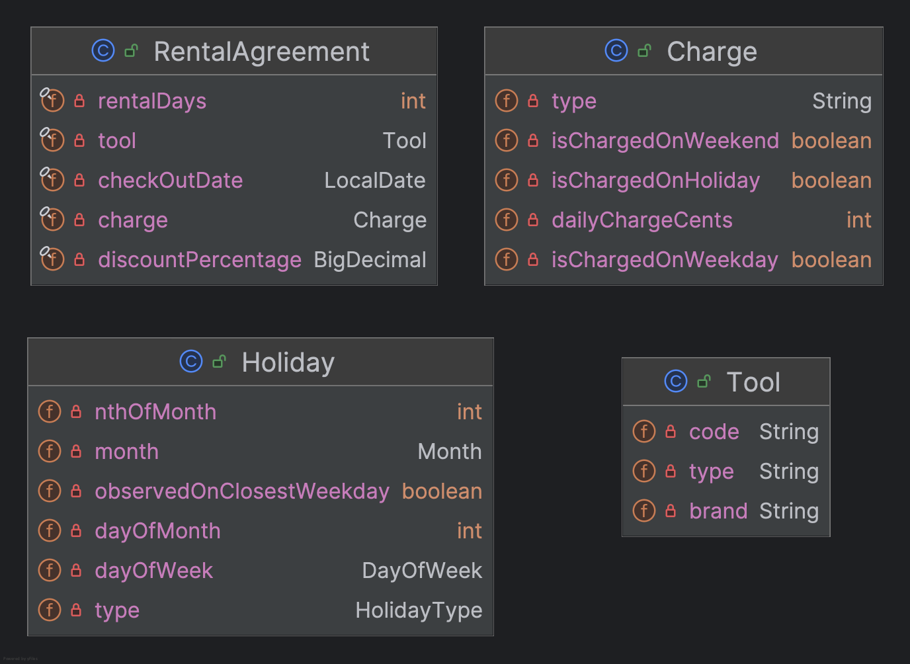
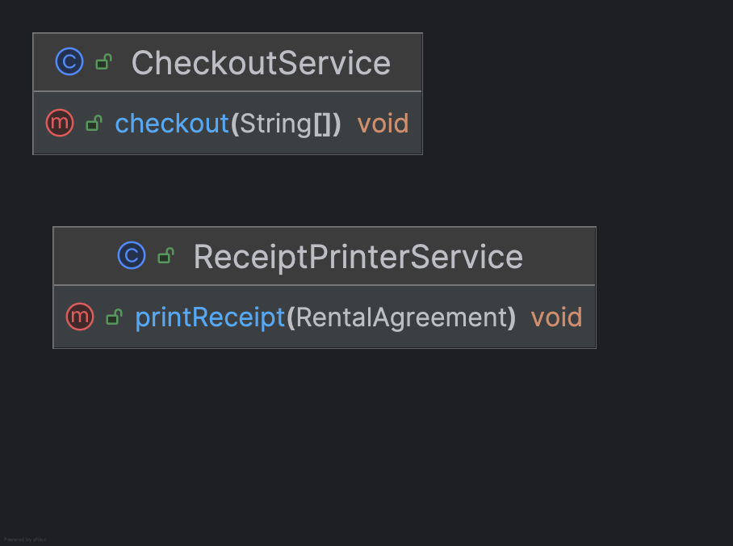

# Application Architecture

## Domain objects

These classes should be available to represent
business logic data and can be easily retrieved
from a database. For the purposes of this exercise,
these will be implemented as hard-coded data in the
application, but this design will allow easy
migration to an external data store when
desired.

Tool: data related to a specific tool type and brand

Charge: data related to the cost of renting a tool and
when the charges are applied

Holiday: data representing holidays

Rental Agreement: data to be persisted for the
newly generated rental agreement based on user input

### Implementation details

Currency should be represented internally as an
integer number-of-cents. This will eliminate any
floating-point rounding errors due to imprecise
conversions.

## Service classes

These service classes will provide the
functionality to implement the business logic
as described by the requirements. The main
processing class is the CheckoutService, which
will consume the provided program arguments,
perform validation on the input,
create an instance of a Rental Agreement
with a snapshot of the tool and charge data,
and invoke the Receipt Printer Service to
generate the output to the console in the
desired format.

## Repositories

Repositories should be implemented as
needed to save and retrieve data from the
database as supported by the data storage
framework. Indexes should be added where
needed to provide efficient lookups.
